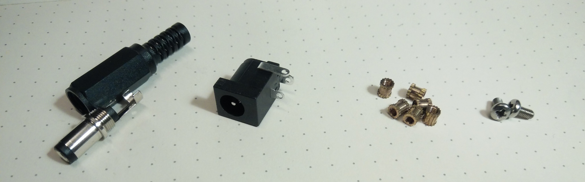
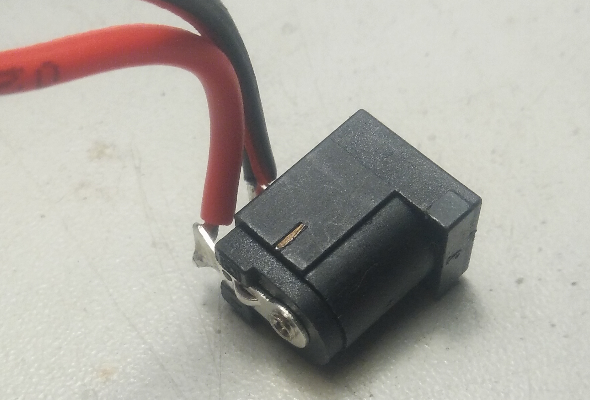

# GHF51-Case

This is a 3D-printable case for the GHF51 single board computer.

&nbsp;

### Design Files

The parts were designed with [FreeCAD](https://freecadweb.org) 0.19.22522

### Printing

The case was designed to be printed with an FFF/FDM printer with a 0.4mm-Ø nozzle.

The GHF51 heatsink can reach 70-80°C, which is beyond the thermal resistance of typical FFF 3D-printing plastics like PLA. I printed the case with _Extrudr Greentec Pro_ filament, which according to the manufacturer has a higher heat resistance. If it doesn't hold up to the temperatures, I'll write an update here.

#### Slicing

I used _Cura_ for this.

###### Main piece (Case-1)

* Print with support for the power socket and ethernet openings.

* HDMI, USB, and lightguide openings and the holes for the threaded inserts don't need support; use the support blocking feature for that (Cura).

##### Side pieces (Case-2 and Case-3)

* Printing the two side pieces at a 45°-angle on an edge results in a nicer surface finish and easier support removal. The fins end up a bit more fragile this way, compared to printing flat/face-up.

* I had good results with tree-supports and brim.

* Make sure to set the seam orientation to the back of the part. Otherwise the fins won't turn out as nicely.

* I printed at 220°C/60°C nozzle/bed temperature.

Unless you've got an amazing(ly well configured) printer, expect to do some part cleanup, due to stringing/oozing and the somewhat intricate geometry.

### Components

You'll need the following additional components:

* Barrel connector plug: Any outer-Ø 5.5mm, inner-Ø 2.1/2.5mm, length 9.5mm barrel plug should work.  I used a _BKL 072111_

* Barrel connector socket: _CLIFF FCR681465_.  There are other brands with the same dimensions that should work

* 6x  M2.5x4x3.6mm threaded inserts.  If your inserts have different dimensions you might have to adapt the model dimensions accordingly.

* 2x  M2.5x5mm pan head screws

* some wire, solder, glue

### Assembly

* use a soldering iron to insert the 6x threaded inserts into Case-1

* squeeze some (semi)transparent glue (e.g. hot glue) into the channel above the power socket to form a light guide

* solder barrel plug to power supply

* break off the pin on the side of the socket to make it fit into the printed part

* solder ~35mm long pieces of wire to the socket pins

* push socket into the corresponding recess

* connect socket/wires to the screw terminal block on the board

* screw board+heatsink to the case with the included 4x M2.5x14mm screws

* screw side pieces (Case-2 and Case-3) to the case with 2x M2.5x5mm screws

* done!

&nbsp;

If you made this, let me know! :-)
